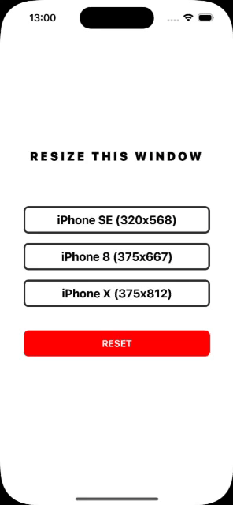

# @ankipro/react-native-window-resize

React Native library to resize app window on iOS. This library is mainly needed to quickly change the screen resolution by simulating different devices without having to open several simulators to test different resolution-dependent functions on the same device. 



## Installation

```sh
yarn add @ankipro/react-native-window-resize
```

install pods

```sh
npx pod-install
```

## Usage

```ts
import WindowResizer from '@ankipro/react-native-window-resize';

// ...

WindowResizer.resizeToDefault();

WindowResizer.resizeTo(deviceModel);

WindowResizer.getAvailableDeviceModels((deviceModels) => ...)
```

For more information see [example](./example/src/App.tsx).

## Methods

Name | Type | Description
-|-|-
.getAvailableDeviceModels() | onComplete: (deviceModels: Array\<[DeviceModel](#types)\>) => void | Get a list of device dimensions that are smaller than the current device
.resizeTo() | (deviceModelName: string) => void | Resize to 'deviceModelName' device
.resizeToDefault() | () => void | Reset to initial window size

## Types

```ts
type DeviceModel = {
  name: string;
  width: number;
  height: number;
};
```

## Contributing

See the [contributing guide](CONTRIBUTING.md) to learn how to contribute to the repository and the development workflow.

## License

MIT

---

Made with [create-react-native-library](https://github.com/callstack/react-native-builder-bob)
